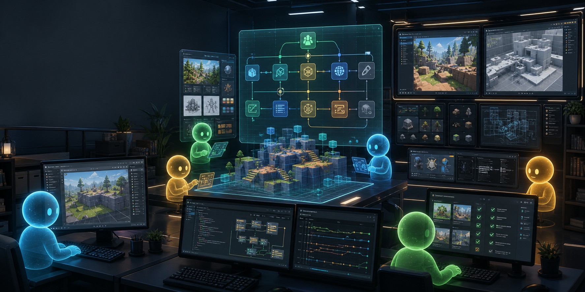

<p align="center">
  <h1 align="center">AI Game Studios</h1>
  <p align="center">
    Turn any AI coding tool into a coordinated game development studio.
    <br />
    49 agents. 73 skills. One coordinated AI team.
  </p>
</p>

<p align="center">
  <a href="LICENSE"></a>
  <a href=".claude/agents"></a>
  <a href=".claude/skills"></a>
  <a href=".claude/hooks"></a>
  <a href=".claude/rules"></a>
  <a href="https://www.buymeacoffee.com/donchitos3"></a>
  <a href="https://github.com/sponsors/Donchitos"></a>
</p>

<p align="center">
  
</p>

---

## Supported AI Tools

This project is built around one simple idea: the game development workflow
should not be locked to one AI vendor or one CLI.

Use the tool you like. `AGENTS.md` is the universal source of truth, and
tool-specific adapters point back to it.

| Tool | Config File | Status |
|------|-------------|--------|
| **Claude Code** | `CLAUDE.md` + `.claude/` | Full support (hooks, skills, agents) |
| **Codex CLI** | `AGENTS.md` | Universal config with manual skill and agent routing |
| **Gemini CLI** | `AGENTS.md` | Universal config with manual skill and agent routing |
| **OpenCode CLI** | `opencode.json` + `.opencode/` + `AGENTS.md` | Adapter support (commands, model routing, universal rules) |
| **Cursor** | `.cursorrules` | Full support (agents, coordination rules) |
| **GitHub Copilot** | `.github/copilot-instructions.md` | Coding standards + collaboration protocol |
| **Windsurf / Codeium** | `.windsurfrules` | Full support (agents, coordination rules) |
| **Aider** | `.aider.conf.yml` | Coding standards + collaboration protocol |
| **Any other AI tool** | `AGENTS.md` | Universal entry point |

> **Universal config**: `AGENTS.md` is the tool-agnostic master configuration.
> Tool-specific files point to it for the full setup.

---

## Why This Exists

AI coding tools are powerful, but game development needs more than a fast code
assistant. A real game project needs design decisions, technical constraints,
QA, production planning, engine-specific knowledge, asset pipelines, release
checks, and a way to keep all of that consistent over many sessions.

Most AI setups start as one chat window. That works for quick edits, but it
breaks down when the project grows:

- Design choices drift because nothing guards the vision.
- Code gets written before the system is designed.
- Tests, accessibility, localization, and release work happen too late.
- Context gets too large, and important decisions vanish into old chat history.
- Switching tools means rewriting the same instructions again.

**AI Game Studios** solves that by giving your AI tool the structure of a real
studio. Instead of one general-purpose assistant, you get 49 specialized agents
organized into a studio hierarchy: directors, department leads, specialists,
engine experts, QA, production, release, and operations.

The user still makes the decisions. The framework provides the process: the
right questions, the right specialist, the right document, the right checkpoint,
and the right quality gate.

## Why It Works Across Tools

Different AI tools have different strengths. Claude Code has strong project
hooks and slash-command ergonomics. Codex, Gemini CLI, OpenCode, Cursor,
Copilot, Windsurf, and Aider each have their own workflows. Locking the studio
architecture to only one of them would make the project less useful.

So the framework is split into two layers:

| Layer | Purpose |
|-------|---------|
| `AGENTS.md` | Universal studio rules, collaboration protocol, model routing, token optimization |
| Tool adapters | Small entry points for each tool: `CLAUDE.md`, `opencode.json`, `.cursorrules`, `.windsurfrules`, Copilot instructions, Aider config |

This means the same project can move between tools without losing its process.
If a tool supports richer features, it gets an adapter. If it does not, it can
still read `AGENTS.md` and follow the same studio workflow.

For tools without native slash commands, commands are still usable as workflow
names. For example, `/token-optimize combat refactor` means: read
`.claude/skills/token-optimize/SKILL.md` and run that workflow with `combat
refactor` as the task argument.

## What This Gives You

- A repeatable game development pipeline from concept to release
- Specialized agents for design, programming, art, audio, narrative, QA, and production
- Engine-aware guidance for Godot, Unity, and Unreal Engine
- Portable model tiers instead of hardcoded vendor model names
- Token optimization rules for long sessions and large projects
- Optional OpenCode commands and engine MCP setup examples
- A collaboration protocol that keeps the user in control

---

## Table of Contents

- [Supported AI Tools](#supported-ai-tools)
- [Why This Exists](#why-this-exists)
- [Why It Works Across Tools](#why-it-works-across-tools)
- [What This Gives You](#what-this-gives-you)
- [What's Included](#whats-included)
- [Studio Hierarchy](#studio-hierarchy)
- [Getting Started](#getting-started)
- [Upgrading](#upgrading)
- [Project Structure](#project-structure)
- [Framework Testing](#framework-testing)
- [How It Works](#how-it-works)
- [OpenCode Adapter](#opencode-adapter)
- [Engine MCP](#engine-mcp)
- [Design Philosophy](#design-philosophy)
- [Customization](#customization)
- [Platform Support](#platform-support)
- [Community](#community)
- [Supporting This Project](#supporting-this-project)
- [License](#license)

---

## What's Included

| Category | Count | Description |
|----------|-------|-------------|
| **Agents** | 49 | Specialized subagents across design, programming, art, audio, narrative, QA, and production |
| **Skills** | 73 | Slash commands for every workflow phase (`/start`, `/design-system`, `/create-epics`, `/create-stories`, `/dev-story`, `/story-done`, etc.) |
| **Hooks** | 12 | Automated validation on commits, pushes, asset changes, session lifecycle, agent audit trail, and gap detection |
| **Rules** | 11 | Path-scoped coding standards enforced when editing gameplay, engine, AI, UI, network code, and more |
| **Templates** | 39 | Document templates for GDDs, UX specs, ADRs, sprint plans, HUD design, accessibility, and more |

## Studio Hierarchy

Agents are organized into three tiers, matching how real studios operate:

```
Tier 1 — Directors (Leader Model)
  creative-director    technical-director    producer

Tier 2 — Department Leads (Standard Model)
  game-designer        lead-programmer       art-director
  audio-director       narrative-director    qa-lead
  release-manager      localization-lead

Tier 3 — Specialists (Standard / Lightweight Model)
  gameplay-programmer  engine-programmer     ai-programmer
  network-programmer   tools-programmer      ui-programmer
  systems-designer     level-designer        economy-designer
  technical-artist     sound-designer        writer
  world-builder        ux-designer           prototyper
  performance-analyst  devops-engineer       analytics-engineer
  security-engineer    qa-tester             accessibility-specialist
  live-ops-designer    community-manager
```

### Engine Specialists

The template includes agent sets for all three major engines. Use the set that matches your project:

| Engine | Lead Agent | Sub-Specialists |
|--------|-----------|-----------------|
| **Godot 4** | `godot-specialist` | GDScript, Shaders, GDExtension |
| **Unity** | `unity-specialist` | DOTS/ECS, Shaders/VFX, Addressables, UI Toolkit |
| **Unreal Engine 5** | `unreal-specialist` | GAS, Blueprints, Replication, UMG/CommonUI |

## Getting Started

### Prerequisites

- [Git](https://git-scm.com/)
- An AI coding tool (Claude Code, Codex CLI, Gemini CLI, OpenCode CLI, Cursor, Windsurf, Copilot, Aider, etc.)
- **Recommended**: [jq](https://jqlang.github.io/jq/) (for hook validation) and Python 3 (for JSON validation)

All hooks fail gracefully if optional tools are missing — nothing breaks, you just lose validation.

### Setup

1. **Clone or use as template**:
   ```bash
   git clone https://github.com/Donchitos/Claude-Code-Game-Studios.git my-game
   cd my-game
   ```

2. **Open your AI tool** and start a session. The tool will read its config file:
   - **Claude Code**: `claude` (reads `CLAUDE.md`)
   - **Codex CLI**: `codex` (reads `AGENTS.md`; route skills by reading `.claude/skills/[name]/SKILL.md`)
   - **Gemini CLI**: `gemini` (point it to `AGENTS.md`; route skills by reading `.claude/skills/[name]/SKILL.md`)
   - **OpenCode CLI**: `opencode` (reads `opencode.json`, `.opencode/commands/`, and `AGENTS.md`)
   - **Cursor**: Open the project (reads `.cursorrules`)
   - **Copilot**: Open in VS Code (reads `.github/copilot-instructions.md`)
   - **Windsurf**: Open the project (reads `.windsurfrules`)
   - **Aider**: `aider` (reads `.aider.conf.yml`)
   - **Other**: Point your tool to `AGENTS.md`

3. **Start designing** — the system guides you through the right workflow:
   - **No idea yet**: Start brainstorming your game concept
   - **Vague concept**: Design systems and choose an engine
   - **Clear design**: Set up architecture and start building
   - **Existing project**: Detect your stage and continue

   If using Claude Code, run `/start` for guided onboarding.

## Upgrading

Already using an older version of this template? See [UPGRADING.md](UPGRADING.md)
for step-by-step migration instructions, a breakdown of what changed between
versions, and which files are safe to overwrite vs. which need a manual merge.

## Project Structure

```
AGENTS.md                           # Universal configuration (all AI tools)
CLAUDE.md                           # Claude Code entry point
opencode.json                       # OpenCode project config
.opencode/                          # OpenCode adapter: commands and model routing
.cursorrules                        # Cursor entry point
.windsurfrules                      # Windsurf entry point
.github/copilot-instructions.md     # GitHub Copilot entry point
.aider.conf.yml                     # Aider entry point
.claude/
  settings.json                     # Hooks, permissions, safety rules (Claude Code)
  agents/                           # 49 agent definitions (markdown + YAML frontmatter)
  skills/                           # 73 slash commands (subdirectory per skill)
  hooks/                            # 12 hook scripts (bash, cross-platform)
  rules/                            # 11 path-scoped coding standards
  statusline.sh                     # Status line script (context%, model, stage, epic breadcrumb)
  docs/
    workflow-catalog.yaml           # 7-phase pipeline definition (read by /help)
    templates/                      # 39 document templates
skill-testing-framework/            # Optional QA specs for the framework itself
src/                                # Game source code
assets/                             # Art, audio, VFX, shaders, data files
design/                             # GDDs, narrative docs, level designs
docs/                               # Technical documentation and ADRs
tests/                              # Test suites (unit, integration, performance, playtest)
tools/                              # Build and pipeline tools
prototypes/                         # Throwaway prototypes (isolated from src/)
production/                         # Sprint plans, milestones, release tracking
```

## Framework Testing

`skill-testing-framework/` contains behavioral specs and catalog coverage for the
AI Game Studios framework itself. It tests skills and agents, not the game you
build with the template.

Keep it if you plan to maintain, extend, or validate the framework. Game projects
that only consume the template can ignore it.

Useful commands:

| Command | Purpose |
|---------|---------|
| `/skill-test static all` | Check structural compliance for all skills |
| `/skill-test spec [name]` | Evaluate one skill against its behavioral spec |
| `/skill-test category [name]` | Evaluate one skill against the category rubric |
| `/skill-test audit` | Show skill and agent coverage status |
| `/skill-improve [name]` | Test, diagnose, propose a fix, and retest a skill |

## How It Works

The framework is built on five ideas:

1. **Vertical delegation** — directors → leads → specialists, with conflict
   escalation to the shared parent.
2. **Collaborative, not autonomous** — every agent follows a strict
   ask → propose options → wait for approval → draft → approve workflow.
   Nothing is written without your sign-off.
3. **Portable model routing** — skills and agents request Lightweight,
   Standard, or Leader capability tiers, not vendor-specific model names.
4. **Token budgets are explicit** — indexes and summaries before full files,
   decisions persisted to disk, `/token-optimize` available for large tasks.
5. **Path-scoped rules** — coding standards are enforced based on file
   location (`src/gameplay/**`, `src/core/**`, `design/gdd/**`, etc).

Full breakdown of each, plus the Claude-Code hook table, tool-specific adapter
details (OpenCode, Cursor, Aider, etc.), and engine-MCP setup:

→ [docs/framework-architecture.md](docs/framework-architecture.md)

## Design Philosophy

This template is grounded in professional game development practices:

- **MDA Framework** — Mechanics, Dynamics, Aesthetics analysis for game design
- **Self-Determination Theory** — Autonomy, Competence, Relatedness for player motivation
- **Flow State Design** — Challenge-skill balance for player engagement
- **Bartle Player Types** — Audience targeting and validation
- **Verification-Driven Development** — Tests first, then implementation

## Customization

This is a **template**, not a locked framework. Everything is meant to be customized:

- **Add/remove agents** — delete agent files you don't need, add new ones for your domains
- **Edit agent prompts** — tune agent behavior, add project-specific knowledge
- **Modify skills** — adjust workflows to match your team's process
- **Add rules** — create new path-scoped rules for your project's directory structure
- **Tune hooks** — adjust validation strictness, add new checks
- **Pick your engine** — use the Godot, Unity, or Unreal agent set (or none)
- **Set review intensity** — `full` (all director gates), `lean` (phase gates only), or `solo` (none)

## Platform Support

Tested on **Windows 10** with Git Bash. All hooks use POSIX-compatible patterns (`grep -E`, not `grep -P`) and include fallbacks for missing tools. Works on macOS and Linux without modification.

## Community

- **Discussions** — [GitHub Discussions](https://github.com/Donchitos/Claude-Code-Game-Studios/discussions) for questions, ideas, and showcasing what you've built
- **Issues** — [Bug reports and feature requests](https://github.com/Donchitos/Claude-Code-Game-Studios/issues)

---

## Supporting This Project

AI Game Studios is free and open source. If it saves you time or helps you ship your game, consider supporting continued development:

<p>
  <a href="https://www.buymeacoffee.com/donchitos3"></a>
  &nbsp;
  <a href="https://github.com/sponsors/Donchitos"></a>
</p>

- **[Buy Me a Coffee](https://www.buymeacoffee.com/donchitos3)** — one-time support
- **[GitHub Sponsors](https://github.com/sponsors/Donchitos)** — recurring support through GitHub

Sponsorships help fund time spent maintaining skills, adding new agents, keeping up with engine API changes, and responding to community issues.

---

*Works with any AI coding tool. Contributions welcome via [GitHub Discussions](https://github.com/Donchitos/Claude-Code-Game-Studios/discussions).*

## License

MIT License. See [LICENSE](LICENSE) for details.
